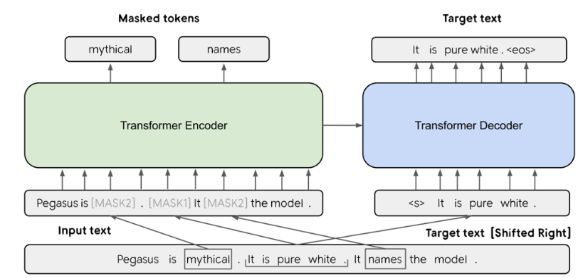

# Mô hình **PEGASUS**, **T5**, **BART**

## 1. Mô hình Pegasus
### a. Tổng quan về mô hình Pegasus:
- Mô hình **Pegasus** là một mô hình Transformer encoder - decoder được Google phát triển chuyên cho bài toán tóm tắt ngữ nghĩa (text summarization). Cấu trúc cơ bản của nó tương tự như kiến trúc Transformer chuẩn, gồm bộ mã hóa (encoder) và bộ giải mã (decoder). Mỗi lớp encoder/decoder Pegasus bao gồm cơ chế **multi-head self-attention** và **feed-forward** giống như Transformer gốc. Pegasus sử dụng **mã hóa vị trí sinusoidai (positional encoding sinusodial)** như trong Transformer gốc. Các thông số chính của Pegasus base là Chiều không gian embedding d = 1024, chiều mạng nơ-ron ẩn FNN = 4096, số heads attention = 16 và mỗi phần encoder/decoder có 16 lớp. 

> [!CAUTION] 
- Nếu chưa nắm được kiến trúc của mô hình Transformer thì có thể đến trang blog này để đọc và nghiên cứu trước: https://pbcquoc.github.io/transformer/

### b. Phương pháp tiền huấn luyện GSG:
Pegasus đưa vào mục tiêu tự giám sát đặc biệt mang tên là **Gap Sentence Generation (GSG)**. Trong GSG, một hoặc nhiều câu trọng yếu được che(bằng **token [MASK1]**) và mô hình được **huấn luyện sinh lại toàn bộ các câu bị ẩn từ phần còn lại của tài liệu**. Trong đó:
- **Chiến lược chọn câu quan trọng:** Không phải mọi câu đều được che. Trong quá trình tiền huấn luyện GSG, Pegasus cần chọn một tập các câu bị che để mô hình học cách sinh lại như tóm tắt. Các tác giả đã thử nghiệm sáu chiến lược khác nhau (Lead, Random, Ind-Orig, v.v.) và kết luận rằng chiến lược Ind-Orig — chọn các câu có độ salience cao nhất — cho kết quả tốt nhất trên cả bốn tập dữ liệu downstream. Điều này khẳng định rằng chọn các câu thực sự quan trọng về mặt thông tin sẽ giúp mô hình học tốt hơn nhiệm vụ tóm tắt, so với chỉ chọn câu đầu hoặc chọn ngẫu nhiên. Do đó, phiên bản PEGASUS chính thức sử dụng chiến lược Ind-Orig làm mặc định cho pretraining

Mô hình Pegasus không chỉ đơn thuần học sinh câu bị che, mà nó **che hẳn các câu đầy đủ** có tính "tóm tắt", rồi yêu cầu mô hình học cách sinh lại chúng - giống như học tóm tắt đoạn văn thành bản tóm tắt súc tích. Ở ví dụ này:
- Với input đầu vào: "Pegasus is mythical. It is pure white. It names the model.". **Pegasus** sẽ chọn một hoặc nhiều câu có nội dung chính (salient) để "ẩn đi" - trong ví dụ này là **"mythical"**, **"names"** và câu **"It is pure white"** Nội dung các câu sẽ được thay bằng các token đặc biệt [MASK1], [MASK2]. 
- Encoder Input (nội dung còn lại với MASK): "Pegasus is [MASK2]. [MASK1] It [MASK2] the model". Đây là những gì được đưa vào **Transformer Encoder**. Mô hình sẽ cố gắng "hiểu" phần còn lại của văn bản. 
- Target Text (đầu ra kì vọng): "It is pure white". Đây là văn bản mà **Transformer Decoder** cần sinh ra - chính là phần nội dung đã bị che, tương đương với một bản tóm tắt. 

Tóm lại, cơ chế GSG trong Pegasus là xóa đi những câu quan trọng nhất trong đoạn vă, rồi dạy mô hình sinh lại chúng như thể đang viết bản tóm tắt. 
### c. Dữ liệu tiền huấn luyện: 
Pegasus được tiền huấn luyện trên các kho dữ liệu văn bản quy mô rất lớn, chủ yếu là dữ liệu web và tin tức. Cụ thể, tác giả sử dụng **C4 (Colossal Clean Craw)** - một tập dữ liệu từ Common Crawl gồm 350 triệu trang web (~750GB văn bản) và **HugeNews** - một tập tổng hợp 1.5 tỷ bài báo  (khoảng 3.8 TB dữ liệu) từ các trang tin tức chất lượng cao (2013-2019). Thống kê kết quả cho thấy tiền huấn luyện trên HugeNews giúp Pegasus đạt hiệu năng tốt hơn trên các bộ dữ liệu tin tức (như XSum, CNN/DM) so với tiền huấn luyện chỉ trên C4, trong khi C4 mạnh hơn với các tập non-news (WikiHow, Reddit TIFU). Điều này phản ánh rằng Pegasus được hưởng lợi khi dữ liệu tiền huấn luyện cùng miền (tin tức) với nhiệm vụ tinh chỉnh, nhờ đó bắt kịp cấu trúc đặc thù của báo chí.

> [!CAUTION]
- Nguồn bài báo "PEGASUS: Pre-training with Extracted Gap-sentences for Abstractive Summarization": https://ar5iv.labs.arxiv.org/html/1912.08777#:~:text=corpora%20with%20a%20new%20self,our%20model%20summaries%20achieve%20human
- Mô hình Pegasus: https://huggingface.co/docs/transformers/model_doc/pegasus

### d. Mô hình Pegasus fine-tuned trên CNN/DailyMail
- Giới thiệu **tập dữ liệu CNN\DailyMail**: Đây là tập dữ lệu tóm tắt tin tức phổ biến gồm 93.000 bài báo của CNN và 220.000 bài của DailyMail, mỗi bài đi kèm với các gạch đầu dòng được biên tập sẵn. **CNN/DailyMail** có điểm điểm bài báo nhiều đoạn ngắn, mỗi đoạn có thể chứa thông tin quan trọng, nên là bài toán điển hình để đánh giá khả năng tóm tắt. 
- Kết quả trên CNN/DailyMail: Pegasus đạt các chỉ số ROUGE rất cao trên CNN/DailyMail so với các phương pháp trước đó. Trên CNN/DM, PegasusLarge tiền huấn luyện trên HugeNews đạt khoảng ROUGE-1 ≈ 43.08, ROUGE-2 ≈ 21.67, ROUGE-L ≈ 31.27